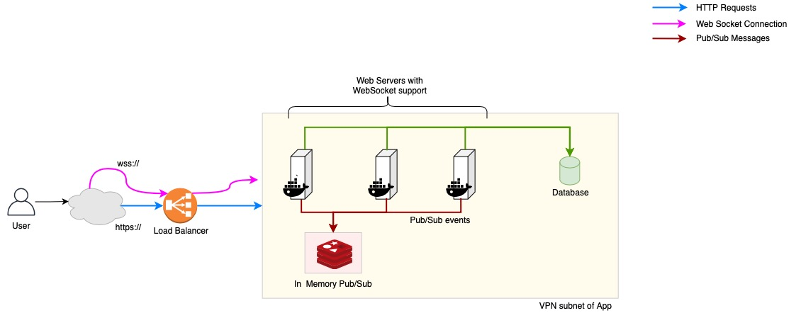
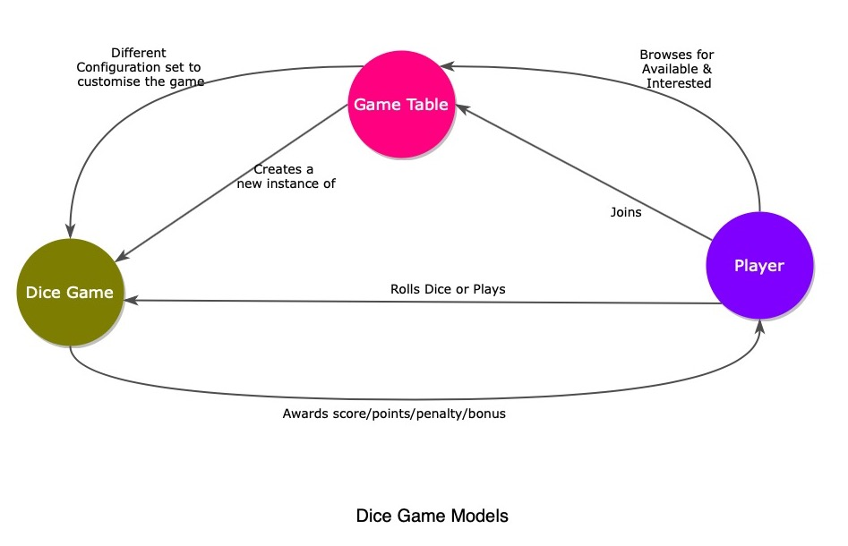

# System Design for Web Version of Multiplayer Dice Game
**Objective**: Help understand challenges of a Multi player Dice Game over web and identify possible solution options

PS : This will be very abstract and purposefully will not be very concrete or specific, however concrete enough to understand problem and solution approach

## 1. Challenges to implement
- Multiple concurrent request threads in parallel, requires faster throughput
- Multiple concurrent active states of multiple games, Games states need to be uniquely identified, maintained isolated, administered and terminated
- Real time communication with client, latency has to be minimal, system must be responsive to user events
- Have to handle network connectivity issues and recover automatically when possible

## 2. Solution highlights
- Event driven Client and Server communication is adopted to make system reactive, responsive and asynchronous processing
- Use of Secure Web Sockets as asynchronous & event driven communication channel, it helps maintain low latency, with two way communication between client and server
- Make Backend services to not maintain any local state, to support distributed processing and horizontally scalability
- Provide REST APIs for synchronous communications, mostly involving CRUD operations
- At backend websocket servers are mutually connected via a shared pub/sub messaging channel to enable horizontal scalability
- Use websockets to model chat rooms, which can be leveraged to isolate game state and its communication
- The websocket layer will also take care of publishing notifications to clients
- Single Page Web App will be the client, which will reduce processing at server and improves responsiveness
- NodeJS based web server is designed to provider faster throughputs and process more requests per second due to its single thread model supporting better parallel processing 

## 3. Overview of system
Below diagram highlights how the system will be structured and deployed, system will require a backend server, which can host the web application and provide necessary processing end points (REST APIs and WebSockets)

A pub/sub channel can be used to logically model a game room or a chat room, to and from which communications can be made as a specific to a game instance, as the pub/sub can contain multiple channels, we can support multiple concurrent game instances. However the pub/sub infra must be deployed using distributed cluster to ensure it is scalable on need.

A database can be connected to save any persistent states required for the game play

It is important to make the web servers run as containers, which enables us to create replicas of the web server to scale in handling the load, hence a Load balancer is necessary to logically handle the domain URL for the web server requests and route or distribute among running web service instances, this can be an Application Load balancer as it need not operate at network layer, it also has to support Web Sockets

## 4. Models of the system
The application is fairly simple and can be modeled as described below, these are the key entity models in the system

Below explain each model's usage or importance

#### DiceGameTable (more like a lobby)
- Models a lobby for registering and playing Dice Game, hence eventually can also handle any entry criteria of paying or deducing any payment
- Game Tables can be created by the system coordinator or by the players by providing values to specific configuration variables and creating a new flavor of the game, such as Max Points, Dice's min and max faces etc.,
- Has min and max capacity
- Has timed window for minimum players to join to begin, waiting begins when the first players enters or joins the table
- At run time maps to a Web Socket Chat Room (or its equivalent) to keep the state of a Game isolated or create a boundary, hence there can be multiple instances of the Game Tables active at the same time
- At run time a user can only part of one DiceGameTable
- Dice Game table will be active for a limited period time, hence has a time schedule (start and finish)
- Dice Game table will be cleared or lobby is ended if enough player do not join or found abandoned or at the end of the game
- Dice Game table can be represented as Game's console in the UI, virtually representing other players in the Game and visually indicating the turns, rolling of the Dice, scores of each player and other game controls
- Hence Dice Game Table becomes a container of widgets and features on the User interface
- System Can create different flavors of the Game as instances of Dice Game Table and list, inviting users to join the Game table, once enough players joined, can begin the game, joining process may involve a small workflow

#### Player
- Models "Account profile" of the player in the system
- Registers scores or points accumulated so far
- Has reference to all the Games played so far

#### Dice Game
- An instance of the actual Dice Game itself, independent of actual or operational nuances, represents pure game and game strategy
- At run time a Game controller owns the life time of the Game and Models the workflow of the Game
- Has references to players who were part of the Game
- Logs of Moves or Rolling of Dice is maintained
- End results of the Game (Player Ranks)
- At run time the Player Ranks can be updated at each move and communicated to Client for a Live update of the player positions

> PS: Depending on the type of the Database model chosen (RDBMS, NoSQL) the actual data model schema can be different, hence actual data model is not documented here

## 5. Other Implementation challenges to solve

### Handling specific nuances of real time communication 

- Application has to sense if a player has disconnected from network and hence either to skip the player or remove player and forfeit the points, else the game can be blocked
	- This has to be done by both server and client
	- Client can keep sending the pulses via websocket at regular intervals, can be every X seconds to server
	- Server on receiving pulses keeps the state of the player active, if not received for a prolonged time (which can be configurable) player has to be preempted from the Game at Server and same should be communicated to clients of other players of the Game
	- If many players disconnected and goes below the minimum required players, server may have to gracefully end the game and relinquish any state resources (memory, etc.,) it had 
	- It is also possible that no game being played but players are connected, i.e., active connection but game moves is not being done, in such case system has to time out the moves and automatically end the game after few successive timed out moves, so that active connections can be closed and system resources can be made free

- Handling refreshes during Game playing should bring back the player to Game state 
	- It is possible users may refresh their user interface and could abort a game accidentally, and waste the Game instances 
	- To guard against such issues, the User Interface has to check for any active games every time user lands on the User Interface and should automatically navigate the user to Game and help rejoin the Game, if player state is still active in the Game and Game itself is active and running
	- A special API may be necessary to support this feature

### Monitoring console 
- Admin users of the system would need a interface to observe number of Games currently in running state, aborted or dangling state
- Using the pub/sub channels we can create a special web socket client for Admin console interface, which subscribes or reads messages from all pub/sub channels and logically renders the Game Tables currently active, waiting etc., 
- Admin uses can select a specific table to view the details of the same, such further drill down details of a table can be fulfilled using REST API calls, to avoid stressing websocket communications 
